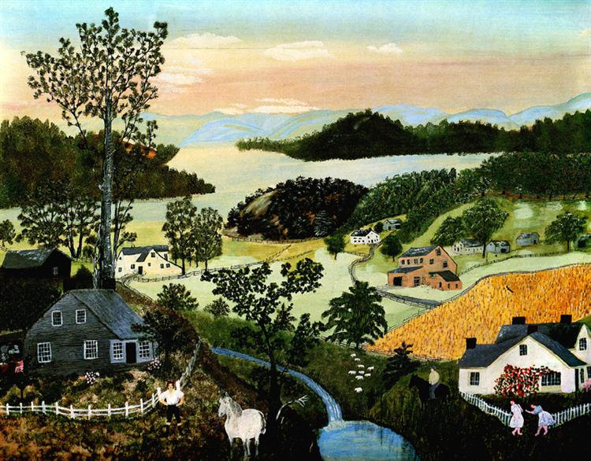
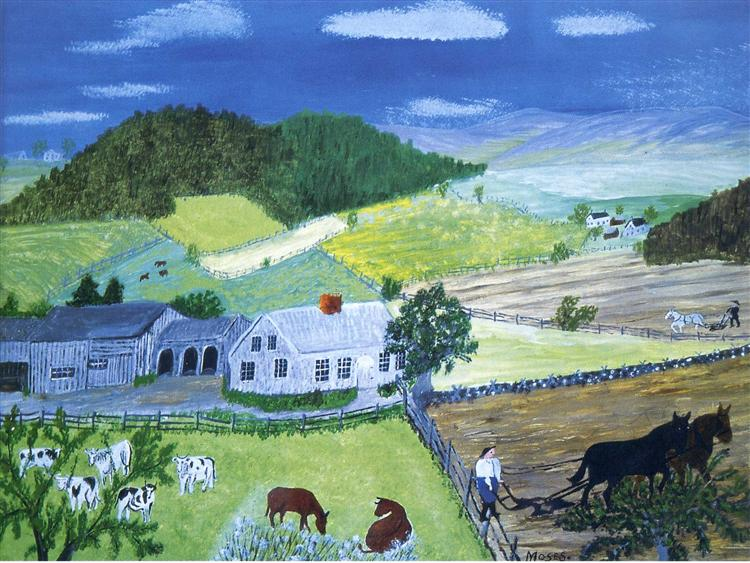
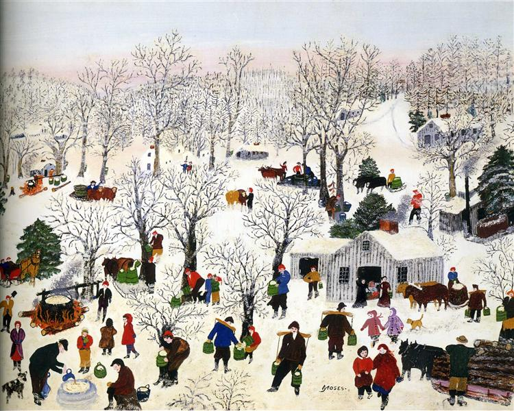
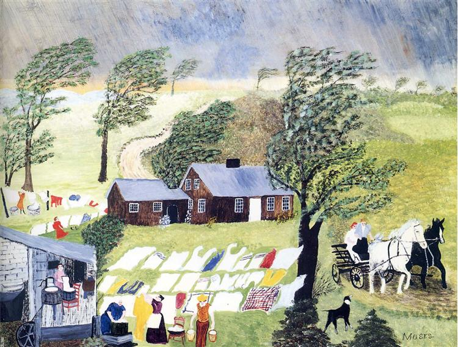

    

        

            

                
            

            

                
            

            

                
            

            

                
            

        

        <a class="carousel-control-prev" href="#carouselExample" role="button" data-slide="prev">
            <i class="fa fa-chevron-left fa-lg text-muted"></i>
            Previous
        </a>
        <a class="carousel-control-next text-faded" href="#carouselExample" role="button" data-slide="next">
            <i class="fa fa-chevron-right fa-lg text-muted"></i>
            Next
        </a>
    

## Grandma Moses

Anna Mary Robertson Moses (September 7, 1860 – December 13, 1961), known by her nickname Grandma Moses, was an American folk artist. She began painting in earnest at the age of 78 and is often cited as an example of an individual who successfully began a career in the arts at an advanced age. Her works have been shown and sold in the United States and abroad and have been marketed on greeting cards and other merchandise. Moses' paintings are displayed in the collections of many museums. The Sugaring Off was sold for US $1.2 million in 2006.

Moses appeared on magazine covers, television, and in a documentary of her life. She wrote an autobiography (My Life's History), won numerous awards, and was awarded two honorary doctoral degrees.
